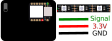

# [English](README.MD)

# Demo
Voir [exemples/WS2812fx/auto_mode_cycle](https://github.com/kitesurfer1404/WS2812FX/blob/master/examples/auto_mode_cycle/auto_mode_cycle.ino)   

https://user-images.githubusercontent.com/2841495/143419751-69e42341-9640-4bab-8265-3c652864d0ad.mp4

# Branchement
## Seeedstudio XIAO


# Essayer
Installer [WS2812fx](https://github.com/kitesurfer1404/WS2812FX) depuis le [gestionnaire de bibliothèques d'Arduino](https://www.awatech.net/2019/10/installer-bibliotheque-arduino.html)

```c
#include <WS2812FX.h>
#define LED_COUNT 13
#define LED_PIN 0
WS2812FX led = WS2812FX(LED_COUNT, LED_PIN, NEO_RGB + NEO_KHZ800);

void setup() {
  Serial.begin(9600);

  led.init(); // Initialise le strip de LED
  
  led.setBrightness(100); // Règle la luminosité (0-255);
  led.setSpeed(1000); // Règle la vitesse (en ms)
  
  led.setColor(leds.Color(255,0,0)); // Change la couleur RGB (Rouge/Vert/Blue)
  led.setMode(0); //Change l'animation (voir https://github.com/usini/WS2812fx_tutorials/edit/main/README_FR.MD)
  
  led.start(); // Démarre l'animation
}

void loop() {
  led.service(); //Fait continuer l'animation
}
```

# Liste des effets
0. **Static** - Une lumière statique
1. **Blink** - Clignotement. 50% du temps on puis off .
2. **Breath** - Respiration (très utilisé dans les objets connectés). Vitesse fixe.
3. **Color Wipe** - Allume toutes les LED, l'une après l'autre, puis les éteint dans le même ordre.
4. **Color Wipe Inverse** - Pareil mais en intervertissant la couleur on et la couleur off.
5. **Color Wipe Reverse** - Pareil que Color Wipe mais à l'envers
6. **Color Wipe Reverse Inverse** - Pareil que Color Wipe Inverse mais à l'envers.
7. **Color Wipe Random** - Pareil que ColorWipe mais avec une couleur aléatoire.
8. **Random Color** - Toutes les LED sont allumés et d'une couleur aléatoire.
9. **Single Dynamic** - Chaque LED a une couleur aléatoire. Les changements de couleur surviennent sur une LED au hasard.
10. **Multi Dynamic** - Chaque LED a une couleur aléatoire. Les changements de couleur surviennent sur toutes les LED.
11. **Rainbow** - Change tout les LED en arc-en-ciel
12. **Rainbow Cycle** - Change toutes les LED en arc-en-ciel sur la totalité du strip de LED.
13. **Scan** - Une LED se déplace de gauche à droite
14. **Dual Scan** - Deux LED se déplace de gauche à droite, chacun dans une direction opposée.
15. **Fade** - Allume et Eteint lentement toutes les LED.
16. **Theater Chase** - Rampes de Lumières de Théatre. Inspiré par les exemples d'Adafruit.
17. **Theater Chase Rainbow** - Rampes de Lumières de Théatre (arc-en-ciel). Inspiré par les exemples d'Adafruit.
18. **Running Lights** - Effets de feux de position (avec une transition addouci en sinusoide).
19. **Twinkle** - Fait clignoter plusieurs LED.
20. **Twinkle Random** - Fait clignoter plusieurs LED dans des couleurs aléatoires.
21. **Twinkle Fade** - Fait clignoter plusieurs LEDS puis s'éteint doucement.
22. **Twinkle Fade Random** - Fait clignoter plusieurs LEDS dans des couleurs aléatoires puis s'éteint doucement.
23. **Sparkle** - Fait clignoter une LED à la fois
24. **Flash Sparkle** - Allume toutes les LED dans la couleur choisi puis fait flasher une LED en blanc aléatoirement.
25. **Hyper Sparkle** - Comme flash sparkle. mais avec plus de flash.
26. **Strobe** - Effet stroboscopique.
27. **Strobe Rainbow** - Effet stroboscopique en arc-en-ciel
28. **Multi Strobe** - Effet stroboscopique avec différentes vitesses (nombre d'allumage/pause).
29. **Blink Rainbow** - Clignotement en arc-en-ciel.
30. **Chase White** - Les LEDS s'allument puis s'éteignent en blanc.
31. **Chase Color** - Blanc suivis de couleurs.
32. **Chase Random** - Blanc suivis d'une couleur aléatoires.
33. **Chase Rainbow** - Blanc sur arc-en-ciel.
34. **Chase Flash** - Flash blanc sur des LEDS avec la couleur choisi.
35. **Chase Flash Random** - Flash blanc sur des LEDS avec une couleur aléatoire.
36. **Chase Rainbow White** - Arc-en-ciel sur fond blanc.
37. **Chase Blackout** - Leds éteintes avec des couleurs.
38. **Chase Blackout Rainbow** -  Leds éteintes avec arc-en-ciel.
39. **Color Sweep Random** - Alternance de couleur aléatoire alternant du début et de la fin du strip.
40. **Running Color** - Couleur alternant entre la couleur choisi et du blanc.
41. **Running Red Blue** - Couleur alternant entre rouge et blue.
42. **Running Random** - Couleur alternant avec des couleurs aléatoires
43. **Larson Scanner** - [K.I.T.T](https://fr.wikipedia.org/wiki/KITT).
44. **Comet** - Effet de comètes
45. **Fireworks** - Effets feu d'artifice.
46. **Fireworks Random** - Couleur aléatoire de feu d'artifice.
47. **Merry Christmas** - Alterne entre rouge et vert.
48. **Fire Flicker** - Effet feu.
49. **Fire Flicker (soft)** - Effet feu (plus doux).
50. **Fire Flicker (intense)** - Effet feu (intense).
51. **Circus Combustus** - Alterne entre blanc/rouge/noir.
52. **Halloween** - Alterne entre orange/violet.
53. **Bicolor Chase** - Deux LEDS dans une couleur de fond.
54. **Tricolor Chase** - Alterne entre trois couleurs.
55. **TwinkleFOX** - Les LEDS s'allume et s'éteigne aléatoirement.
